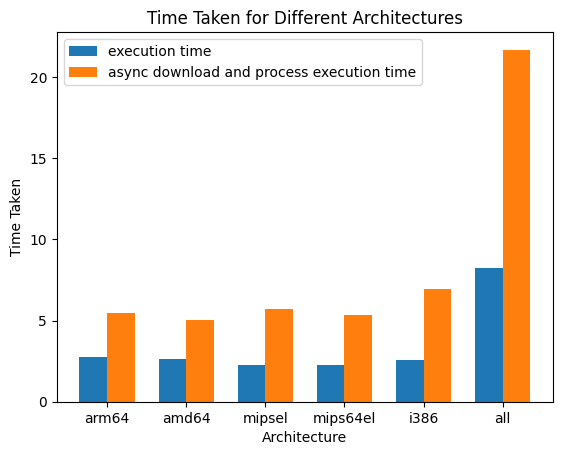

# Debian Package Statistics
A python tool to fetch statistics of debian packages - Collect the top 10 packages by the number of files they are present in.

---

## Instructions

Debian uses *deb packages to deploy and upgrade software. The packages are stored in repositories and each repository contains the so called "Contents index". The format of that file is well described here https://wiki.debian.org/RepositoryFormat#A.22Contents.22_indices

 

Your task is to develop a python command line tool that takes the architecture (amd64, arm64, mips etc.) as an argument and downloads the compressed Contents file associated with it from a Debian mirror. The program should parse the file and output the statistics of the top 10 packages that have the most files associated with them. An example output could be:

 

./package_statistics.py amd64

 

<package name 1>         <number of files>
<package name 2>         <number of files>
......

<package name 10>         <number of files>
 

You can use the following Debian mirror: http://ftp.uk.debian.org/debian/dists/stable/main/. Please try to follow Python's best practices in your solution. Hint: there are tools that can help you verify your code is compliant. In-line comments are appreciated.

---

## Setup

To setup and run this project,

Install requirements> ``` pip install -r requirements.txt ``` \
Give required permissions to execute the file

---

## CLI

```
$ python3 package_statistics.py --help
usage: package_statistics.py [-h] [-m MIRROR_URL] [-u] [-l LIMIT]
                             [-o OUTPUT_DIR] [-s SKIP_DOWNLOAD]
                             architecture

CLI tool to get the package statistics of debian packages given architecture.

positional arguments:
  architecture          Architecture of the packages to parse.

options:
  -h, --help            show this help message and exit
  -m MIRROR_URL, --mirror_url MIRROR_URL
                        Mirror URL for contents files. DEFAULT:
                        http://ftp.uk.debian.org/debian/dists/stable/main/
  -u, --udeb            Include udeb file for architecture. DEFAULT: False
  -l LIMIT, --limit LIMIT
                        Top 'l' number of packages with maximum count of
                        files. DEFAULT: 10
  -o OUTPUT_DIR, --output-dir OUTPUT_DIR
                        Download location for content files DEFAULT: current-
                        working-directory/downloads
  -s SKIP_DOWNLOAD, --skip-download SKIP_DOWNLOAD
                        Skip download if files are already present and newer
                        than 's' days. DEFAULT: 10
```

### Development

My initial thoughts to the solution were to filter and download the required files, and process them sequentially. I quickly realized that this is slowing down the module since waiting for files to sequentially download(some of which are quite large) before processing is a huge I/O block.
I did manage to save some time processing time by not writing from decompressed gzip to another file, rather process the data in memory. But this was inefficient as well, since I was processing large amounts of data at a time.
This code can be seen in the ```helper\package_statistics_helper.py``` which took about 4 hours to code, along with the functions in ```helper\common_utils.py```

I started reworking the code using asyncio, aiofiles and aiohttp modules which allow for asynchronous downloads and read and write from storage.
- Used the asyncio.as_completed call to process files as soon as their download completes while other downloads happen.
- Split the file into chunks of smaller size to pass to a mapper api, for memory efficiency.
-- experimented with the batch size. Found most efficient to be 5000 lines.
- Added an option to skip file downloads if they are newer than input number of days, since these files may be subject to frequent changes.

I took 3-4 hours for research and tests, before writing and debugging the code in 6-8 hours. These changes improved the execution time by upto 10 seconds(when downloading and fetching stats for all the files in the directory) in comparison to synchronized version. Results discussed next.

Asynchronous code is single threaded where it would give me greater control in utilizing IO time for other tasks.
I looked into the following for improving the execution:
- multithreading: Project would not be portable subject to GIL and I would have a dependency on a multi-processor system.
- multiprocessing: Using the python multiprocessing module to use sub-processes. I observed during testing that this module has a high overhead while spawing tasks and the latency was not suitable

In total, I spent 20-24 hours in research and development of the project.
### Testing

Using python unittest module, I wrote valid and invalid unit test cases for utility functions. They test the utilities for fetching and processing the list of content files, filtering them and printing the results correctly.

## Results

Some sample results and time taken:

##### Synchronous code
architecture: arm64
```
Package                                                  File Count
devel/piglit                                             53007
science/esys-particle                                    18408
math/acl2-books                                          17023
libdevel/libboost1.81-dev                                15456
libdevel/libboost1.74-dev                                14333
lisp/racket                                              9599
net/zoneminder                                           8161
electronics/horizon-eda                                  8130
libdevel/libtorch-dev                                    8089
libdevel/liboce-modeling-dev                             7458
Time taken: 4.7096991539001465
```
##### Asynchronous code
architecture: arm64 \
With download \
```$ python3 package_statistics.py arm64 -u```
```
Package                                                  File Count
devel/piglit                                             53007
science/esys-particle                                    18408
math/acl2-books                                          17023
libdevel/libboost1.81-dev                                15456
libdevel/libboost1.74-dev                                14333
lisp/racket                                              9599
net/zoneminder                                           8161
electronics/horizon-eda                                  8130
libdevel/libtorch-dev                                    8089
libdevel/liboce-modeling-dev                             7458
Time taken: 4.449158191680908
```
Skip download

```$ python3 package_statistics.py arm64 -u -s 1```
```
Package                                                  File Count
devel/piglit                                             53007
science/esys-particle                                    18408
math/acl2-books                                          17023
libdevel/libboost1.81-dev                                15456
libdevel/libboost1.74-dev                                14333
lisp/racket                                              9599
net/zoneminder                                           8161
electronics/horizon-eda                                  8130
libdevel/libtorch-dev                                    8089
libdevel/liboce-modeling-dev                             7458
Time taken: 2.6743550300598145
```
All files with download
```
Package                                                  File Count
devel/piglit                                             477063
chromium                                                 460282
thunderbird                                              375159
firefox-esr                                              372003
qt6-webengine                                            218812
libreoffice                                              169255
science/esys-particle                                    165672
math/acl2-books                                          152287
qtwebengine-opensource-src                               143418
libdevel/libboost1.81-dev                                139104
Time taken: 54.36145305633545
```
### Comparing results
 \
All results from module execution on my PC: \
- CPU: 1.4 GHz Quad-Core Intel Core i5 \
- RAM: 8 GB 2133 MHz LPDDR3 \
